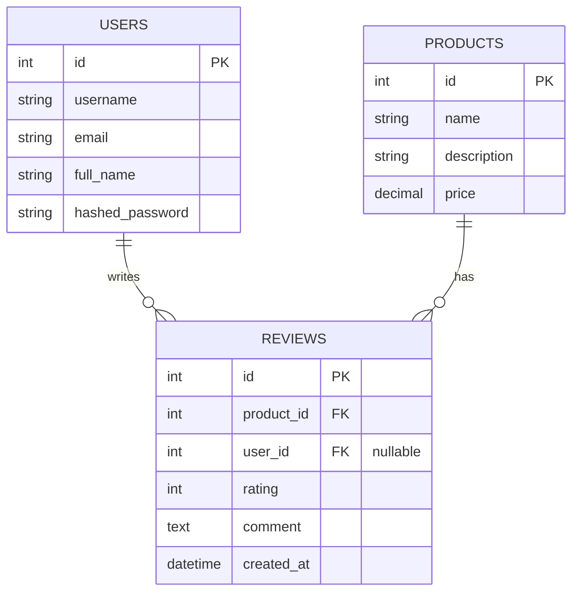

# Product-Reviews Table

## Data requirements

1. What table do you need?

   We need a `reviews` table to store customer feedback for products. Each review should belong to one product, and may belong to a user when the user is still active.

2. Which columns, and which are nullable?

   - `id`: primary key, not nullable
   - `product_id`: foreign key to `products.id`, not nullable
   - `user_id`: foreign key to `users.id`, nullable
   - `rating`: integer review score, usually from 1 to 5, not nullable
   - `comment`: review text, nullable because some users may leave only a rating
   - `created_at`: server-generated timestamp when the review is created, not nullable

   `created_at` should be handled by the database server (for example, a default timestamp or database trigger) rather than by the application layer, so the record always captures the true creation time even if the app is bypassed or the client clock is wrong.

3. What the foreign key point to, and what happens on delete (casecade, restrict, set null)

   - `product_id` points to `products.id`
     - On delete: `CASCADE`
     - Reason: if the product is removed, its reviews should also be removed.

   - `user_id` points to `users.id`
     - On delete: `SET NULL`
     - Reason: if the user is deleted, the review should remain in the system as an anonymous comment, preserving the content while removing the personal reference.

   This table is a review log that connects `users` and `products`, with extra information about the review score and optional comment. The `user_id` is nullable so the review can remain visible even after the user account is removed.

## ER Diagram

- `REVIEWS.product_id` references `PRODUCTS.id` and uses `ON DELETE CASCADE`
- `REVIEWS.user_id` references `USERS.id` and uses `ON DELETE SET NULL`
- A review may still exist after the user is deleted, but it becomes anonymous because `user_id` becomes `NULL`.